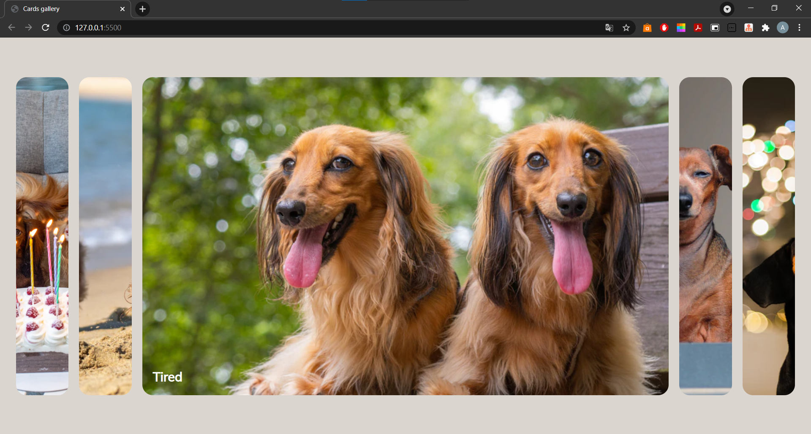

<h1 align="center">Cards gallery</h1>

## Description

**HOMEPAGE**

<h2 align="center">Live Demo</h2>

**Cards gallery**

It's a drop-down card plugin. Pictures of funny and cute dogs is used by me, however you can edit the code and choose pictures for your interests for perhaps your future site. Plugin is written using HTML, CSS and JavaScript. The gallery consists of 5 slides. The third picture is automatically opened, but you can edit the code and set the first slide that opens of your choice.

## Click edition

- **Click** the left mouse key to switch the sliders.